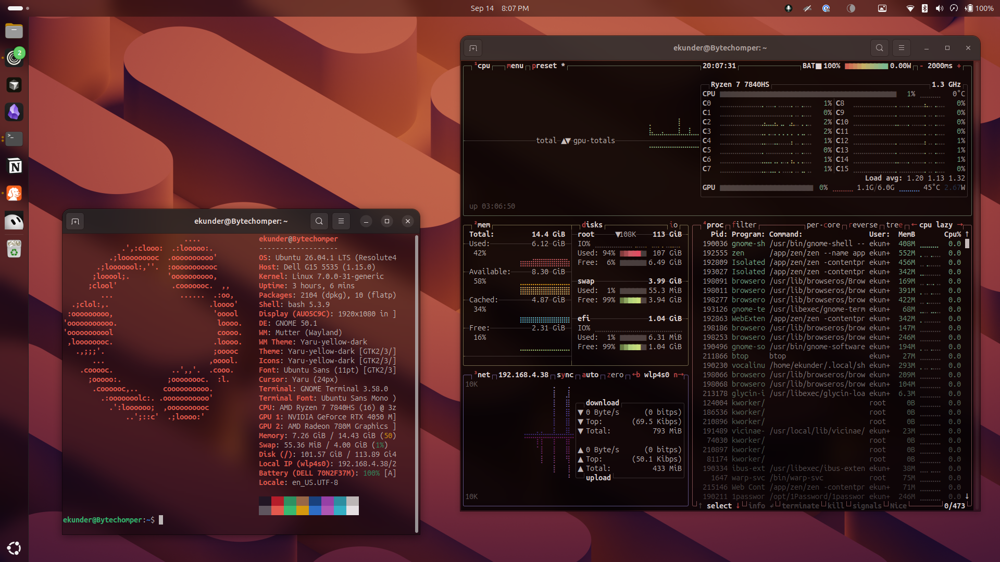
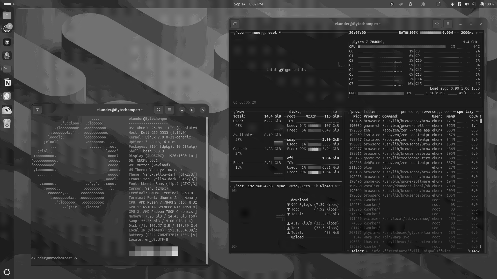
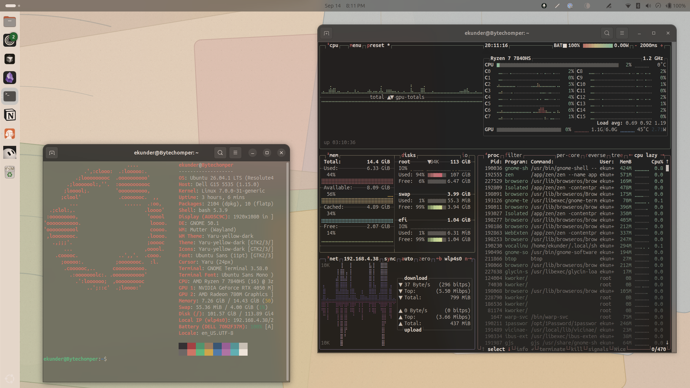

# Paper modes for GNOME

Three toggleable looks for GNOME: your normal desktop, a black-and-white e-ink grade, and a warm stationery “color paper” theme.

The compositor helper grades the whole screen (windows, icons, and chrome). Color paper also swaps GTK, dock, wallpaper, and icons. Regular puts your saved appearance back.

Developed on **Ubuntu with GNOME Shell 50** (Wayland). The helper declares support for GNOME 46–50.

## Screenshots

Drop PNGs into `screenshots/` using these names — they show up here automatically:

| Regular | Ink | Color paper |
| --- | --- | --- |
|  |  |  |

## Install

Needs `git`, `python3`, `gsettings`, and `gnome-extensions` (a normal Ubuntu GNOME session already has the last three).

```bash
git clone https://github.com/3t1-1aN/gnome-paper-modes.git
cd paper-modes
./install.sh
```

You can clone it anywhere; keep that folder. The installer only symlinks into it.

That will:

1. Put `paper-mode` on `~/.local/bin`
2. Enable the `paper-modes@local` compositor helper
3. Bind **Super+Shift+P** to cycle looks

Then **log out and back in once** so GNOME loads the helper. After that:

```bash
paper-mode cycle          # or Super+Shift+P
paper-mode ink
paper-mode color-paper
paper-mode regular
```

If `paper-mode` is “command not found”, either open a new terminal or add this to your shell profile:

```bash
export PATH="$HOME/.local/bin:$PATH"
```

Uninstall (restores regular, removes the helper and shortcut; the clone stays):

```bash
paper-mode uninstall
```

## Usage

```text
paper-mode                 # current mode
paper-mode status
paper-mode regular         # your normal Ubuntu look
paper-mode ink             # e-ink, black and white
paper-mode color-paper     # warm stationery desktop
paper-mode cycle           # regular → ink → color-paper → regular
paper-mode toggle          # last paper look ↔ regular
```

A tray icon on the top bar switches the same three modes.

## Looks

**Regular** restores the snapshot taken when you first left it (GTK theme, icons, accent, wallpaper, dock, night light).

**Ink** is a Carta-style e-ink grade: no saturation, slightly soft contrast, charcoal blacks, paper whites, a handful of gray levels, and light Bayer dither. Night light is turned off so it does not fight the grade.

**Color paper** is a light stationery UI (Yaru, slate accent, paper dock and wallpaper) plus a mild warm wash so leftover app chrome and icons pick up the same pigment.

Mode switches wash from one look into the next instead of snapping.

## Config

Edit `config` in the clone, then run `paper-mode` again (or pick the mode from the tray).

| Knob | Role |
| --- | --- |
| `TRANSITION_MS` | Wash duration in milliseconds |
| `CYCLE_ORDER` | Cycle sequence |
| `KEYBINDING` | Cycle shortcut |
| `INK_*` | E-ink grade (`SATURATION`, `CONTRAST`, `BLACK`, `WHITE`, `LEVELS`, `GRAIN`) |
| `COLOR_*` | Color-paper wash |

Keep `INK_SATURATION=0` and `INK_TEMPERATURE=6500` so midtones stay gray. Lower `INK_CONTRAST` / raise `INK_BLACK` for a milkier page; the reverse for denser pigment.

## Notes

- Do not delete the clone after install; the helper is a symlink into it.
- GNOME does not reload extension JavaScript on disable/enable under Wayland. After you change `extension/`, log out once.
- Existing GTK windows may need a restart to pick up color-paper CSS.
- Blur my Shell works with ink; glass panels keep their opacity.
- State lives in `~/.local/state/paper-modes/`.
